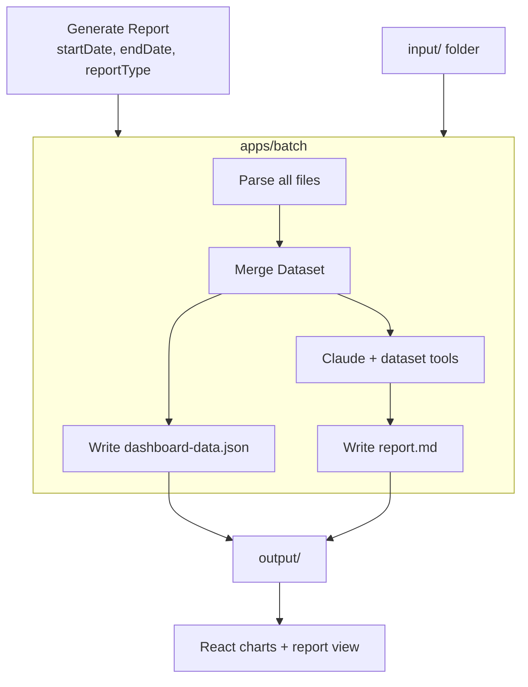

# Weekly QA Metrics Dashboard

A file-based reporting platform for QA teams. Stage exports in `input/`, generate a dashboard and AI report on demand, and explore interactive charts — **no database required**.

---

## Overview

QA teams produce valuable data every week — test runs, bug counts, change request assignments, project risk assessments — but that data is often scattered across spreadsheets, JIRA exports, and PDFs.

This dashboard parses staged files when you explicitly click **Generate Report**, merges them into an in-memory dataset, writes `output/dashboard-data.json` and a Claude narrative report, and serves both to a React UI with ISO-week or custom date-range filtering.

**Design principle:** no background jobs, no auto-import, no SQLite. State lives in files (`input/`, `output/`, `config/mappings/`) and browser `localStorage` (chart preferences).

---

## Key Features

| Feature | Description |
|---|---|
| **Resource Dashboard** | Per-resource test execution, bug reporting, and CR assignment breakdown |
| **Project Status** | Weekly project health with completion %, risks, blockers, and accomplishments |
| **Multi-Format Import** | Stage XLSX, CSV, TSV, JSON, PDF, and XML — parsing runs only at Generate |
| **JIRA Column Mapping** | Auto-detect known JIRA headers or save maps in `config/mappings/` |
| **Date Range Filtering** | Filter all views by ISO week or custom `startDate` / `endDate` |
| **Generate on Demand** | Batch job writes `dashboard-data.json` + AI report in one action |
| **Chart Picker** | Choose which charts to show; preferences persist in `localStorage` |
| **Zero-Hallucination AI** | Claude queries an in-memory dataset via eight tools — no invented numbers |

---

## Trigger Model

| Action | What happens |
|---|---|
| Drop file in `input/` or UI upload | File is **stored only** — no parsing, no AI |
| User clicks **Generate Report** | Batch runs once: parse → merge → filter → write JSON + AI report |
| User opens dashboard tabs | UI reads last `output/dashboard-data.json` (empty state if never generated) |
| User picks charts | Client-side only — no batch |

---

## Architecture

```
┌─────────────────────────────────────────────────────────────────┐
│                     Browser (React + Vite)                       │
│  Resources │ Project Status │ Import │ AI Report │ Charts │ ⚙   │
└────────────────────────────┬────────────────────────────────────┘
                             │ HTTP
┌────────────────────────────▼────────────────────────────────────┐
│                   Express API (thin file server)                 │
│  POST /api/generate   GET /api/dashboard   GET /api/report      │
│  POST /api/upload     GET /api/input/files  GET/POST /mappings  │
└────────────────────────────┬────────────────────────────────────┘
                             │ runGenerate()
┌────────────────────────────▼────────────────────────────────────┐
│                      apps/batch pipeline                         │
│  discover input/* → parse (xlsx/csv/json/pdf/xml) → merge       │
│  → buildDashboardPayload() → write output/dashboard-data.json   │
│  → Claude + 8 dataset tools → output/report.md                  │
└──────────────┬──────────────────────────────┬───────────────────┘
               │                              │
        ┌──────▼──────┐                ┌──────▼──────┐
        │  input/     │                │  Claude API │
        │  output/    │                │ (tool-use)  │
        │  config/    │                └─────────────┘
        └─────────────┘
```

### Batch Pipeline Flow



### AI Zero-Hallucination Flow

```
Generate Report request
        │
        ▼
  Claude receives system prompt + 8 in-memory dataset tool definitions
        │
        ├─► get_resource_summary()   → filter weeklyLog → real rows
        ├─► get_project_status()     → filter projectStatus → real rows
        ├─► get_risk_summary()       → filter risks/blockers → real rows
        └─► writes report using ONLY returned data
        │
        ▼
  report.md written to output/ (UI loads on next fetch)
```

Claude never invents numbers. If a tool returns empty data, the report states *"No data available for this period."*

---

## Technology Stack

### Backend & Batch

| Technology | Role |
|---|---|
| **Node.js + Express** | Thin REST API — trigger batch, serve files |
| **TypeScript** | Type safety across batch, API, and web |
| **xlsx** | Excel and CSV parsing |
| **pdf-parse** | PDF text extraction |
| **multer** | Multipart file upload to `input/` |
| **@anthropic-ai/sdk** | Claude API with tool-use for reports |

### Frontend

| Technology | Role |
|---|---|
| **React 18** | UI component framework |
| **Vite** | Dev server and production bundler |
| **Tailwind CSS** | Utility-first styling |
| **Recharts** | Bar, line, and donut charts |
| **@tanstack/react-query** | Server state and caching |
| **react-markdown + remark-gfm** | AI report rendering |

### Infrastructure

| Technology | Role |
|---|---|
| **Docker + Docker Compose** | Containerised deployment |
| **Nginx** | Static frontend with API proxy |

---

## Project Structure

```
dashboard/
├── input/                  # Staged exports (gitignored)
├── output/                 # Last generate run (gitignored)
├── config/
│   ├── mappings/           # Saved JIRA column maps (gitignored)
│   └── charts.default.json
├── scripts/
│   └── generate-report.bat # Windows CLI helper
├── templates/
│   └── team-metrics-template.xlsx
├── apps/
│   ├── batch/              # Parsers, merge, dataset tools, CLI
│   │   └── src/
│   │       ├── parsers/    # xlsx, csv, json, pdf, xml dispatcher
│   │       ├── jira/       # Detection, mapping, normalize
│   │       ├── export/     # dashboard-data.json builder
│   │       └── ai/         # datasetTools + reportWriter
│   ├── api/                # Express routes → runGenerate()
│   └── web/                # React UI
├── docker-compose.yml
└── .env.example
```

---

## Data Model

The Excel template contains five sheets normalized into a single `Dataset`:

| Sheet / Entity | Purpose |
|---|---|
| `Resources` | Team members — ID, name, team, role |
| `Projects` | Active projects — ID, name, manager, dates, status |
| `CRs` | Change requests linked to projects |
| `Weekly_Log` | One row per resource × CR × week — test cases, bugs, hours |
| `Project_Status_Weekly` | One row per project × week — completion %, risks, blockers |

JIRA and other exports are mapped to this schema before dashboard and AI steps.

---

## Getting Started

### Prerequisites

- Node.js 20+
- npm 10+

### Local Development

```bash
# 1. Install dependencies
npm install

# 2. Configure environment
cp .env.example .env
# Edit .env — set ANTHROPIC_API_KEY

# 3. Start API + frontend
npm run dev
```

| Service | URL |
|---|---|
| API | http://localhost:3001 |
| UI | http://localhost:5173 |

### Workflow

1. **Stage files** — copy exports to `input/` or use the **Import Data** tab (upload stores only).
2. **Generate** — **AI Report** tab → set date range and report type → **Generate Report** (may take 1–3 min).
3. **Explore** — **Resources** and **Project Status** tabs read the last generated JSON.
4. **Charts** tab — toggle visible charts (saved in browser).

### CLI (headless)

```bash
npm run generate -- \
  --start-date 2026-06-21 \
  --end-date 2026-06-26 \
  --report-type full
```

Report types: `full` | `executive` | `resources` | `projects`

Windows: `scripts/generate-report.bat`

### Docker

```bash
docker compose up --build -d
```

Mounts `./input`, `./output`, and `./config`. Set `ANTHROPIC_API_KEY` in `.env`.

App: http://localhost:3000

---

## Supported Input Formats

| Format | Extensions | Handler |
|---|---|---|
| Excel | `.xlsx`, `.xls` | Template sheets or JIRA-style sheets |
| CSV / TSV | `.csv`, `.tsv` | Native CSV parser; JIRA auto-map |
| JSON | `.json` | Template schema or JIRA REST export |
| PDF | `.pdf` | Text extraction + heuristic tables |
| XML | `.xml` | JIRA RSS/XML export |

When columns don't match the template, auto-detect JIRA headers or save a mapping under **Import → JIRA column mapping**.

---

## API Reference

| Method | Path | Description |
|---|---|---|
| `POST` | `/api/generate` | Run batch (`startDate`, `endDate`, `reportType`, optional `projectId`) |
| `GET` | `/api/dashboard` | Last `dashboard-data.json` or 404 |
| `GET` | `/api/report` | Last `report.md` + `report-meta.json` or 404 |
| `GET` | `/api/status` | `{ apiKeyConfigured: boolean }` |
| `POST` | `/api/upload` | Stage file to `input/` (no parsing) |
| `GET` | `/api/input/files` | List staged files |
| `DELETE` | `/api/input/:filename` | Remove staged file |
| `GET` | `/api/mappings` | List saved column maps |
| `POST` | `/api/mappings` | Save column map for a filename pattern |

---

## Configuration

| Variable | Default | Description |
|---|---|---|
| `PORT` | `3001` | API server port |
| `ANTHROPIC_API_KEY` | _(required for AI)_ | Claude API key for report generation |
| `INPUT_DIR` | `./input` | Staged export folder |
| `OUTPUT_DIR` | `./output` | Generated dashboard + report |
| `CONFIG_DIR` | `./config` | Mapping configs |
| `PROJECT_ROOT` | _(auto)_ | Repo root for path resolution |

The API key is read from `.env` only — not stored in a database or Settings UI.

---

## License

MIT
